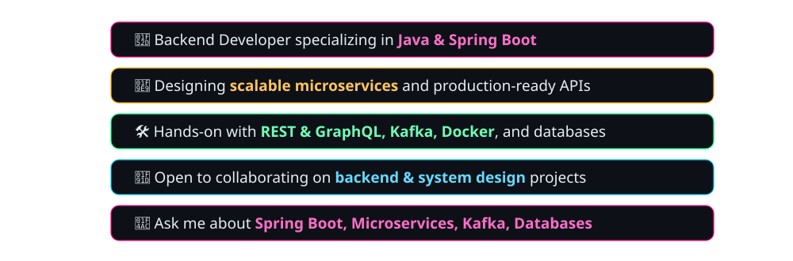
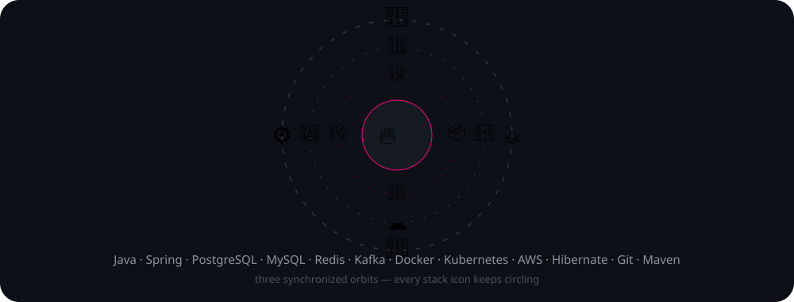
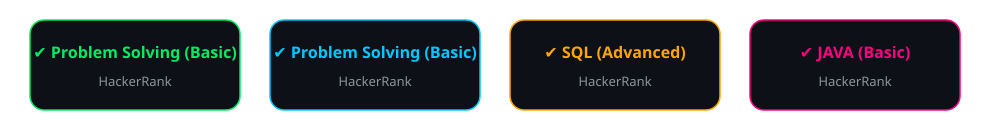
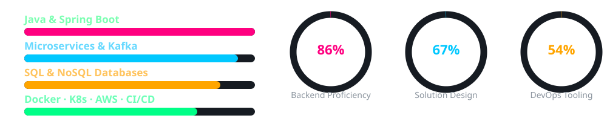

  

  
  

  

---

## 👨‍💻 About Me

  

> ⚡ **Fun fact:** I enjoy turning complex problems into clean backend solutions.

---

## ⚙️ Tech Stack

  

  

---

## 🤝 Connect with Me

  

  
  
  
  

---

## 🏅 Certifications

  

- [HackerRank Problem Solving (Basic)](https://www.hackerrank.com/certificates/676404ac45ca)
- [HackerRank Problem Solving (Basic)](https://www.hackerrank.com/certificates/68dd05c02666)
- [HackerRank SQL (Advanced)](https://www.hackerrank.com/certificates/6be97483c87e)
- [HackerRank JAVA (Basic)](https://www.hackerrank.com/certificates/1ddc0e781c02)

---

## 📊 Skill Meters

  

  
  
  

---

  

