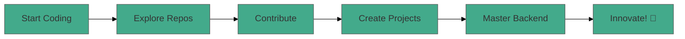

<h1 align="center">Hi 👋, I'm Karan Sahani</h1>
<h3 align="center">
🚀 Backend Developer | Java & Spring Boot | Scalable Systems & Microservices 🚀
</h3>

  🌐 <strong>Portfolio:</strong> 
  <a href="https://karansahani-portfolio.vercel.app" target="_blank">
    https://karansahani-portfolio.vercel.app
  </a>

---

## 👨‍💻 About Me
- 🔭 Backend Developer specializing in **Java & Spring Boot**
- 🧩 Designing **scalable microservices** and production-ready APIs
- 🛠️ Hands-on with **REST & GraphQL**, **Kafka**, **Docker**, and databases
- 🤝 Open to collaborating on **backend & system design projects**
- 💬 Ask me about **Spring Boot, Microservices, Kafka, Databases**
- ⚡ Fun fact: I enjoy turning complex problems into clean backend solutions
---

### 🌟 Tech Stack:

  

---

### 🏆 Featured Projects:
- 🌱 [**SpringBoot-Crud-Generator**](https://github.com/karansahani78/Springboot-crud-generator) - Trusted by 500+ developers to generate production-ready Spring Boot CRUD backends.
- 🛡️ [**defence-mission-planning-command-system**](https://github.com/karansahani78/defence-mission-planning-command-system) - A defence‑grade backend system that models real‑world mission planning, command authority, asset management, and secure telemetry pipelines. This project is intentionally designed to reflect real military / defence command systems, focusing on security, correctness, auditability, and observability.
- 🚀 [**REST++ (Rest Plus Plus)**](https://github.com/karansahani78/restpp) - REST++ is a framework-level redesign of REST that delivers GraphQL-like query flexibility while preserving REST’s simplicity, HTTP semantics, and cacheability.
- 🏡 [**Rental-service**](https://github.com/karansahani78/Rental-service) - A property rental service for managing rentals efficiently.  
- 🧾 [**Decentralized Certificate Generator**](https://github.com/karansahani78/decentralized-certificate-generator-pinata-kafka.git)  
  A robust system that generates verifiable certificates using Kafka and stores them securely on IPFS via Pinata.
- 🍽️ [**Restaurant Review System**](https://github.com/karansahani78/restaurant-review-system.git)  
  A full-featured restaurant review platform allowing users to post, rate, and manage dining experiences.
- 🔗 [**URL Shortener**](https://github.com/karansahani78/url-shortner.git)  
  A simple and scalable service to shorten long URLs with analytics and redirect tracking.  
  A complete microservice-based e-commerce backend system using Spring Cloud, Eureka, API Gateway, and more.

---

### 📊 GitHub Stats:

  
  

---

### 🏆 GitHub Contributions:

  

---

### 🚀 My GitHub Journey:

```mermaid
%%{init: {"theme": "base", "themeVariables": {"primaryColor": "#43aa8b", "edgeLabelBackground":"#4d908e"}} }%%
graph LR
A[Start Coding] --> B[Explore Repos] --> C[Contribute] --> D[Create Projects] --> E[Master Backend] --> F[Innovate! 🚀]
```

---

### 🌐 Connect with Me:

  
  
  
  

---

### 🏅 Certifications:
- [HackerRank Problem Solving (Basic)](https://www.hackerrank.com/certificates/676404ac45ca)  
- [HackerRank Problem Solving (Basic)](https://www.hackerrank.com/certificates/68dd05c02666)  
- [HackerRank SQL (Advanced)](https://www.hackerrank.com/certificates/6be97483c87e)  
- [HackerRank JAVA (Basic)](https://www.hackerrank.com/certificates/1ddc0e781c02)  

---

### ⚡ Fun Fact:
I can turn coffee into code faster than you can say "Hello World!" ☕🚀
