<h1 align="center">Hi 👋, I'm Karan Sahani</h1>
<h3 align="center">🚀 Backend Developer | Java Enthusiast | Problem Solver 🚀</h3>

  

---

### 👨‍💻 About Me:
- 🔭 Mastering **Backend Development with Java and Spring Boot**  
- 🤝 Passionate about open-source and collaborating on **innovative Java projects**  
- 🎓 Blending **Computer Science and Engineering** knowledge with real-world skills  
- 💬 Ask me anything about building scalable backend systems!  
- ⚡ Fun Fact: I turn complex problems into seamless solutions!  

---

### 🌟 Tech Stack:

  

---

### 🏆 Featured Projects:
- 🏡 [**Rental-service**](https://github.com/karansahani78/Rental-service) - A property rental service for managing rentals efficiently.  
- 🗳️ [**Decentralized Voting System**](https://github.com/karansahani78/Decentralized-Voting-System) - A secure voting system using Ethereum Blockchain.  
- ⚽ [**PremierZone**](https://github.com/karansahani78/PremierZone) - Predict match outcomes with machine learning.  

---

### 📊 GitHub Stats:

  
  

---

### 🏆 GitHub Contributions:

  

---

### 🚀 My GitHub Journey:

```mermaid
%%{init: {"theme": "base", "themeVariables": {"primaryColor": "#43aa8b", "edgeLabelBackground":"#4d908e"}} }%%
graph LR
A[Start Coding] --> B[Explore Repos] --> C[Contribute] --> D[Create Projects] --> E[Master Backend] --> F[Innovate! 🚀]
```

---

### 🌐 Connect with Me:

  
  
  
  

---

### 🏅 Certifications:
- [HackerRank Problem Solving (Basic)](https://www.hackerrank.com/certificates/676404ac45ca)  
- [HackerRank Java (Basic)](https://www.hackerrank.com/certificates/68dd05c02666)  
- [HackerRank SQL (Advanced)](https://www.hackerrank.com/certificates/6be97483c87e)  
- [HackerRank SQL (Basic)](https://www.hackerrank.com/certificates/1ddc0e781c02)  

---

### ⚡ Fun Fact:
I can turn coffee into code faster than you can say "Hello World!" ☕🚀
